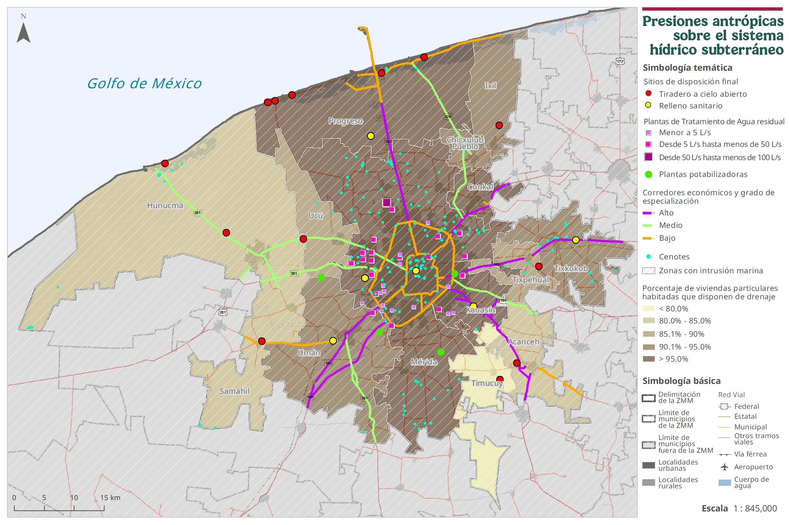
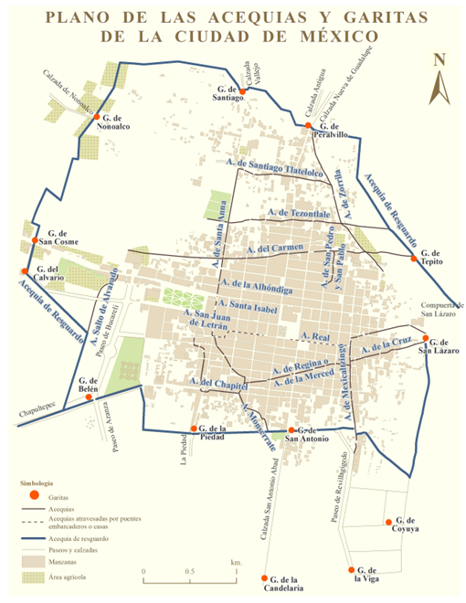
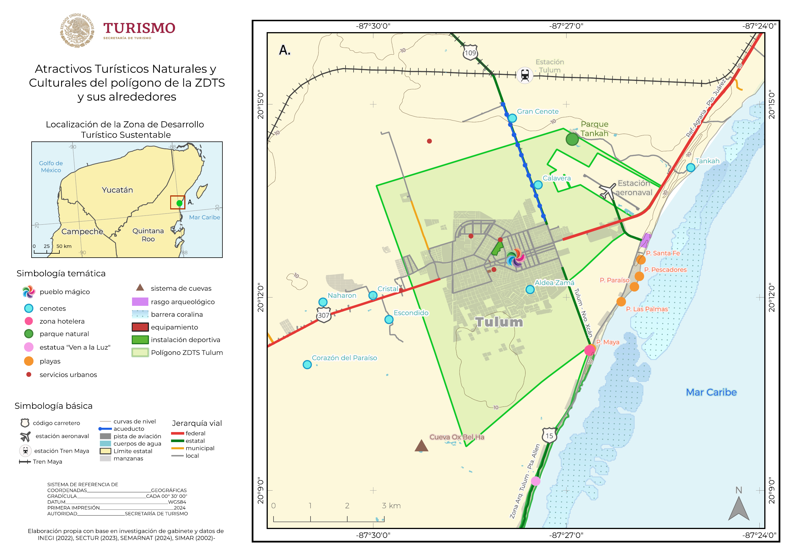
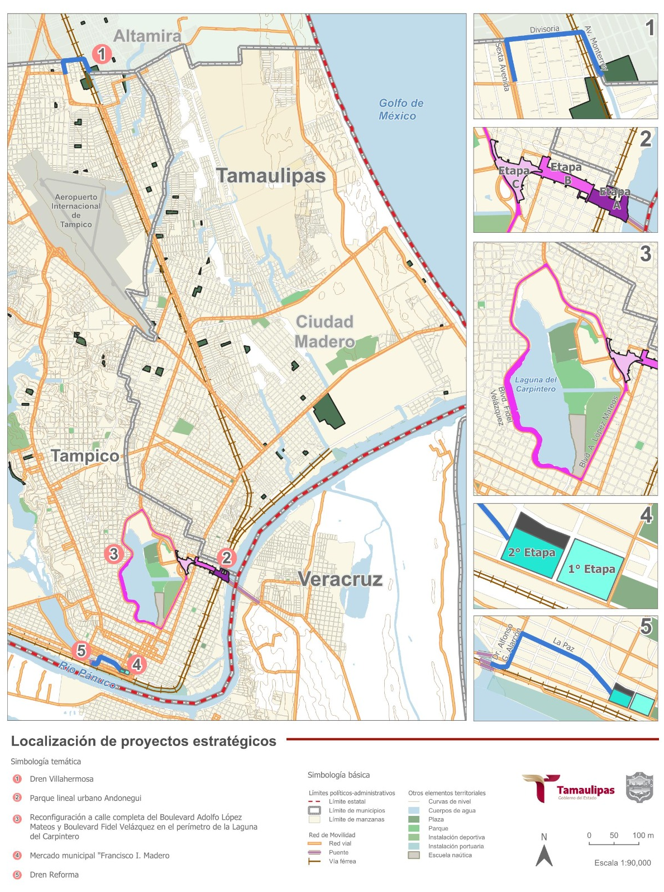

# Cartography Portfolio (GIS)

Portafolio de cartografía y productos SIG desarrollados para instrumentos de planeación territorial, movilidad, análisis urbano y proyectos estratégicos.

**Áreas:** Planeación territorial y urbana · Movilidad · Infraestructura · Cartografía temática · Análisis espacial  
**Herramientas:** QGIS / ArcGIS · SIG vector/raster · Layout cartográfico · Control de calidad cartográfica  
**Stack SIG:** Geodatabases · Topología · Metadatos · Diccionario de datos · Modelo entidad–relación · Estandarización de capas · Publicación en SITU (SEDATU) · Integración SIG institucional

---

## Proyectos destacados

### 01) PUMOT – Proyecto de Programa de Ordenamiento Territorial de la Zona Metropolitana de Mérida (2025)
**Institución / Cliente:** SEDATU (a través de Consultoría privada)  
**Rol:** Coordinadora de Sistemas de Información Geográfica (SIG)  
**Descripción:** Coordinación SIG para la producción cartográfica oficial del programa y su publicación en SITU: estandarización de capas, validación topológica, control de calidad, metadatos y diccionarios de datos, estructuración de geodatabase y entrega de insumos geoespaciales listos para integración institucional.

  

---

### 02) PIMUS – Carmen, Campeche (2025)
**Institución / Cliente:** SEDUMOP / Gobierno del Estado de Campeche (a través de Consultoría privada)  
**Rol:** Coordinadora del área SIG  
**Descripción:** Coordinación SIG para cartografía base y temática del PIMUS: actualización cartográfica del área de estudio, integración de insumos multifuente, generación de shapefiles/Geodatabase con topología, modelo entidad–relación, metadatos y productos para análisis territorial, infraestructura existente y propuestas.

  

---

### 03) PIMUS – Escárcega, Campeche (2025) 
**Institución / Cliente:** SEDUMOP / Gobierno del Estado de Campeche (a través de Consultoría privada)   
**Rol:** Coordinadora del área SIG  
**Descripción:** Coordinación SIG para cartografía base y temática del PIMUS: actualización cartográfica del área de estudio, integración de insumos multifuente, generación de shapefiles/Geodatabase con topología, modelo entidad–relación, metadatos y productos para análisis territorial, infraestructura existente y propuestas.

  

---

### 04) Programa Metropolitano – Coatzacoalcos, Veracruz (2022) 
**Institución / Cliente:** SEDATU (a través de Consultoría privada)
**Rol:** Encargada del área SIG  
**Descripción:** Producción y control de calidad de cartografía del programa: armado de capas temáticas, consistencia geométrica y validación topológica, documentación técnica (metadatos) y paquetes SIG listos para consulta, análisis y soporte de decisiones en el instrumento.

  

---

### 05) Actualización PMDU – Hecelchakán, Campeche (2024)
**Institución / Cliente:** SEDATU (a través de Consultoría privada)
**Rol:** Cartografía temática  
**Descripción:** Elaboración de cartografía temática para actualización de PMDU: normalización de insumos, construcción de capas para diagnóstico y estrategia urbana, estandarización de simbología y salidas de impresión, y organización de datasets para uso operativo en SIG.

  

---

### 06) Actualización PMDU – Tenabo, Campeche (2024)
**Institución / Cliente:** SEDATU  (a través de Consultoría privada)
**Rol:** Cartografía temática  
**Descripción:** Elaboración de cartografía temática para actualización de PMDU: normalización de insumos, construcción de capas para diagnóstico y estrategia urbana, estandarización de simbología y salidas de impresión, y organización de datasets para uso operativo en SIG.

  

---

### 07) Plan Parcial – Área de influencia Tren Maya, Palenque (FONATUR, 2021)
**Institución / Cliente:** FONATUR (a través de Consultoría privada)
**Rol:** Cartografía temática + apoyo al diagnóstico territorial  
**Descripción:** Cartografía temática y diagnóstico territorial del área de influencia: integración y depuración de información geoespacial, construcción de capas analíticas y entrega integrada al Sistema de Información Geográfica de FONATUR, asegurando compatibilidad, documentación y consistencia espacial.

  

---

### 08) Cartografía histórica – Acequias (Ciudad de México) (2024)
**Producto:** Cartografía histórica para capítulo editorial.  
**Descripción:** Digitalización y reconstrucción espacial de acequias y garitas con base en el libro *Las acequias de la Ciudad de México* (Alejandro Jiménez Vaca) y de investigación, para el libro UNAM *La Ciudad de México en la era del Neoclásico* (en preparación).

  

---

### 09) ZDTS – Tulum (SECTUR, 2024)
**Producto:** Delimitación y cartografía de soporte para la Zona de Desarrollo Turístico Sustentable (ZDTS).  
**Descripción:** Soporte cartográfico para delimitación de ZDTS: integración espacial, delimitación y representación temática para sustento técnico del instrumento y comunicación de criterios territoriales.

  

---

### 10) Proyectos estratégicos de equipamiento e infraestructura – Tampico (2025)
**Producto:** Cartografía aplicada para apoyo a planeación y proyectos estratégicos.  
**Descripción:** Elaboración de cartografía técnica para equipamiento e infraestructura: integración de capas multifuente, salidas temáticas para comunicación y soporte de diagnóstico territorial, y organización de insumos SIG para análisis y actualización.

  

---

## Nota
Por confidencialidad, se publica una selección de productos y/o versiones de referencia.

